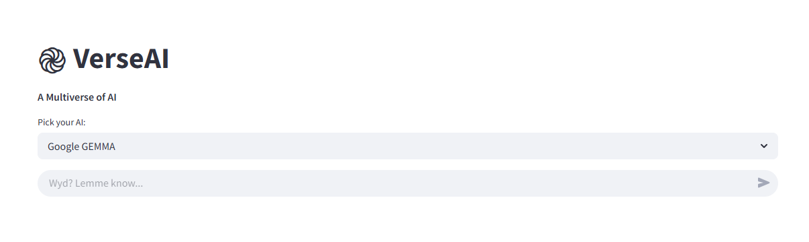

# ֎ VerseAI

<div align="center">
  
</div>

An interactive platform powered by Groq that allows users to explore and chat with various cutting-edge AI models, offering a glimpse into the diverse landscape of artificial intelligence.

## 🚀 Features

-   **Multi-Model Chat:** Seamlessly switch between different AI models within the same interface.
-   **Dynamic Model Selection:** Choose from a curated selection of leading models, including those from Google and Meta.
-   **Chat History Management:** Retain and revisit previous conversations with each AI model.
-   **Conversation Clearing:** Easily clear the current chat to start fresh.
-   **User-Friendly Interface:** Intuitive design powered by Streamlit for effortless interaction.

## 🖱️ How to Use

1.  **Select** an AI model from the "Pick your AI" dropdown.
2.  **Type** your prompt in the chat input ("Wyd? Lemme know...").
3.  **Send** your message and receive a response from the chosen AI.
4.  **Explore** different models to compare their responses.
5.  **Manage** chat history in the sidebar:
    -   Clear the current chat.
    -   Review previous conversations with each model.
    -   Delete specific model chat histories.

## 🖥️ Tech Stack


## 🧩 Key Components

| Component            | Technology Used   | Purpose                                     |
| -------------------- | ----------------- | ------------------------------------------- |
| Chat Interface       | Streamlit        | Provides the user interface for interaction |
| AI Model Integration | Groq              | Connects to and utilizes the AI models     |
| Model Management     | Python Dictionaries | Stores and manages AI model details         |
| Environment Config   | python-dotenv     | Handles API key securely                  |
| Chat History         | Streamlit Sessions | Manages conversation history               |

## 🛠️ Installation

### Prerequisites

-   Python 3.9+
-   Groq API key (Obtain from Groq)

### Setup Instructions

####   1.  Clone the repository

```bash
git clone [https://github.com/yourusername/verseai.git](https://www.google.com/search?q=https://github.com/yourusername/verseai.git)  # Replace with your actual repo
cd verseai
```

#### 2. Create virtual environment

###### Windows:
```bash
python -m venv venv
.\venv\Scripts\activate
```
###### MacOS/Linux:
```bash
python3 -m venv venv
source venv/bin/activate
```

#### 3. Install dependencies
```bash
pip install -r requirements.txt
```

#### 4. Configure API key
###### Create .env file with
```bash
GOOGLE_API_KEY="your_api_key_here"
```

## 🖥️ Usage

#### 1. Start the application:
```bash
streamlit run app.py
```
#### 2. Access in browser ([App Link](https://rez-up.streamlit.app/))

## 🤝 Contributing
If you would like to contribute to this project, please follow these steps:

1. Fork the repository.
2. Create a new branch for your feature or bug fix.
3. Make your changes and submit a pull request.


## 📜 License
MIT License

## 📬 Contact
If you have any questions or issues, feel free to reach out to the developer:

**Developer:- Smit Patel**

**Email:- smit23492@gmail.com**


---

© 2025 VerseAI. All rights reserved.
